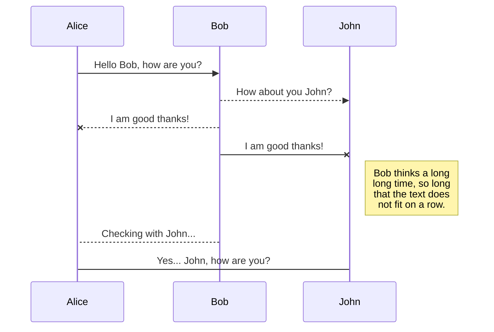
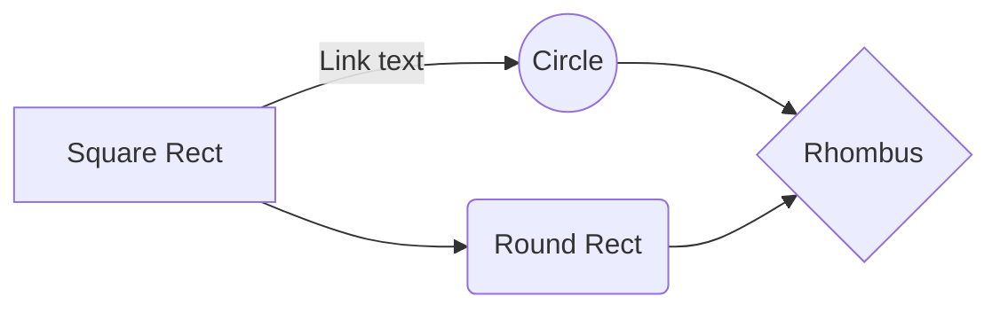

# rspec_checkout
## Example repository about ruby TDD using Rspec
- Install gem rspec by using: `gem install rspec`
- Clone this repository
- Open folder and run `rspec spec/checkout_spec.rb`


# Tản mạn về Big O

Hi mọi người, mình là Hiếu, 1 developer cùi "bép" ở 1 công ty startup nọ. Mình rất đam mê [giải thuật](https://en.wikipedia.org/wiki/Algorithm) ( nhưng mình khá cùi ) nên mình đã làm khá nhiều dạng bài. Khi vừa bắt đầu tập tành, mình lúc nào cũng thoả mãn với việc mình giải ra 1 bài toán với tư duy logic ( nghe khá nguy hiểm ), nhưng vào lúc đó mình luôn luôn chỉ **code 1 cách mù quáng, code cho ra.**


Ví dụ như ai đó bảo mình tìm phần tử trùng trong 1 mảng `n` phần tử với `n-1` phần tử khác nhau chẳng hạn. Mình sẽ vò đầu bứt tóc, nhăn nhó, suy tư để viết ra 1 thứ như thế này:

```javascript
	function findDuplicate(arr){
		for(var i = 0; i < arr.length-1; i++)
			for(var j = i + 1; j < arr.length; j++)
				if(arr[i] == arr[j])
					return arr[i];
	}
```

Đoạn code trên chắc hẳn ai đọc cũng hiểu nhể :weary:. Mình dùng 2 vòng lặp vòng đầu tiên chạy từ `0 -> length-1` của array, vòng 2 thì chạy phần tử `i+1 -> length` của array, yeahhhhh mình sẽ so sánh điều kiện nếu nó `arr[i] == arr[j]` thì đó là số mình tìm. WooHoo cuối cùng cũng giải được 1 bài toán khó, quẩy thôi nào :sunglasses:. Bài này tới đây là hết nhé.

Haha đùa thôi, đoạn code này sử dụng ***2 vòng lặp lồng vào nhau*** và mỗi vòng lặp chạy n phần tử ( đừng bắt bẻ chỗ `n-1` hay `n` mà :worried: ), nghĩa là nó sẽ duyệt qua n*n phần tử. Hổng biết đề cho mình 1 mảng 3 phần tử hay 300 triệu phần tử nữa, lo quá lỡ chạy cái này đứng máy thì sao huhu. ***Không sao đã có Big O***. Vậy Big O là gì ?


## Big O là gì ?
Khái niệm về cái này khá là vờ lờ. 

> Big O là một ký hiệu toán học mô tả hành vi giới hạn của hàm
> khi đối số có xu hướng hướng tới một giá trị cụ thể hoặc vô cùng.

Mình dịch từ Wiki chứ mình cũng méo hiểu cái đống quote ở trên đâu hihi. Khó hiểu quá, thử tìm 1 vấn đề trong cuộc sống xem sao :alien:

### Imtermet và chim bồ câu:

Ngày xửa ngày xưa, thời ăn lông ở lỗ người tối cổ, họ đã phát mình ra 1 hệ thống mạng gọi là Imtermet, nhưng tốc độ thì chậm vô cùng. Một hôm ở một gia đình nọ họ chuẩn bị làm món **ch

## Switch to another file

All your files are listed in the file explorer. You can switch from one to another by clicking a file in the list.

## Rename a file

You can rename the current file by clicking the file name in the navigation bar or by clicking the **Rename** button in the file explorer.

## Delete a file

You can delete the current file by clicking the **Remove** button in the file explorer. The file will be moved into the **Trash** folder and automatically deleted after 7 days of inactivity.

## Export a file

You can export the current file by clicking **Export to disk** in the menu. You can choose to export the file as plain Markdown, as HTML using a Handlebars template or as a PDF.


# Synchronization

Synchronization is one of the biggest features of StackEdit. It enables you to synchronize any file in your workspace with other files stored in your **Google Drive**, your **Dropbox** and your **GitHub** accounts. This allows you to keep writing on other devices, collaborate with people you share the file with, integrate easily into your workflow... The synchronization mechanism takes place every minute in the background, downloading, merging, and uploading file modifications.

There are two types of synchronization and they can complement each other:

- The workspace synchronization will sync all your files, folders and settings automatically. This will allow you to fetch your workspace on any other device.
	> To start syncing your workspace, just sign in with Google in the menu.

- The file synchronization will keep one file of the workspace synced with one or multiple files in **Google Drive**, **Dropbox** or **GitHub**.
	> Before starting to sync files, you must link an account in the **Synchronize** sub-menu.

## Open a file

You can open a file from **Google Drive**, **Dropbox** or **GitHub** by opening the **Synchronize** sub-menu and clicking **Open from**. Once opened in the workspace, any modification in the file will be automatically synced.

## Save a file

You can save any file of the workspace to **Google Drive**, **Dropbox** or **GitHub** by opening the **Synchronize** sub-menu and clicking **Save on**. Even if a file in the workspace is already synced, you can save it to another location. StackEdit can sync one file with multiple locations and accounts.

## Synchronize a file

Once your file is linked to a synchronized location, StackEdit will periodically synchronize it by downloading/uploading any modification. A merge will be performed if necessary and conflicts will be resolved.

If you just have modified your file and you want to force syncing, click the **Synchronize now** button in the navigation bar.

> **Note:** The **Synchronize now** button is disabled if you have no file to synchronize.

## Manage file synchronization

Since one file can be synced with multiple locations, you can list and manage synchronized locations by clicking **File synchronization** in the **Synchronize** sub-menu. This allows you to list and remove synchronized locations that are linked to your file.


# Publication

Publishing in StackEdit makes it simple for you to publish online your files. Once you're happy with a file, you can publish it to different hosting platforms like **Blogger**, **Dropbox**, **Gist**, **GitHub**, **Google Drive**, **WordPress** and **Zendesk**. With [Handlebars templates](http://handlebarsjs.com/), you have full control over what you export.

> Before starting to publish, you must link an account in the **Publish** sub-menu.

## Publish a File

You can publish your file by opening the **Publish** sub-menu and by clicking **Publish to**. For some locations, you can choose between the following formats:

- Markdown: publish the Markdown text on a website that can interpret it (**GitHub** for instance),
- HTML: publish the file converted to HTML via a Handlebars template (on a blog for example).

## Update a publication

After publishing, StackEdit keeps your file linked to that publication which makes it easy for you to re-publish it. Once you have modified your file and you want to update your publication, click on the **Publish now** button in the navigation bar.

> **Note:** The **Publish now** button is disabled if your file has not been published yet.

## Manage file publication

Since one file can be published to multiple locations, you can list and manage publish locations by clicking **File publication** in the **Publish** sub-menu. This allows you to list and remove publication locations that are linked to your file.


# Markdown extensions

StackEdit extends the standard Markdown syntax by adding extra **Markdown extensions**, providing you with some nice features.

> **ProTip:** You can disable any **Markdown extension** in the **File properties** dialog.


## SmartyPants

SmartyPants converts ASCII punctuation characters into "smart" typographic punctuation HTML entities. For example:

|                |ASCII                          |HTML                         |
|----------------|-------------------------------|-----------------------------|
|Single backticks|`'Isn't this fun?'`            |'Isn't this fun?'            |
|Quotes          |`"Isn't this fun?"`            |"Isn't this fun?"            |
|Dashes          |`-- is en-dash, --- is em-dash`|-- is en-dash, --- is em-dash|


## KaTeX

You can render LaTeX mathematical expressions using [KaTeX](https://khan.github.io/KaTeX/):

The *Gamma function* satisfying $\Gamma(n) = (n-1)!\quad\forall n\in\mathbb N$ is via the Euler integral

$$
\Gamma(z) = \int_0^\infty t^{z-1}e^{-t}dt\,.
$$

> You can find more information about **LaTeX** mathematical expressions [here](http://meta.math.stackexchange.com/questions/5020/mathjax-basic-tutorial-and-quick-reference).


## UML diagrams

You can render UML diagrams using [Mermaid](https://mermaidjs.github.io/). For example, this will produce a sequence diagram:



And this will produce a flow chart:


